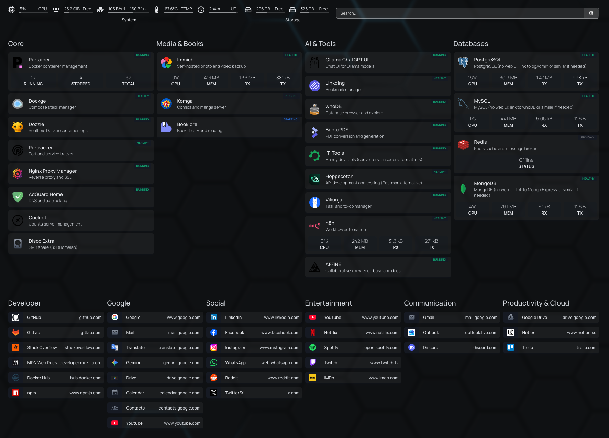

# Homelab

Docker-based homelab configuration: databases, core infrastructure, and self-hosted apps. All services share a `proxy-net` network and are managed with [Task](https://taskfile.dev).



## Quick start

1. **Create the shared Docker network** (one-time):
   ```bash
   ./init.sh
   ```

2. **Start everything** from the repo root:
   ```bash
   task init
   ```

3. **Start a single service** from its directory:
   ```bash
   cd db/postgres
   task postgres
   ```

4. **Start on reboot** — see [BOOT.md](BOOT.md) to enable Docker and/or the homelab boot service.

> Requires [Task](https://taskfile.dev) (`brew install go-task` / `go install github.com/go-task/task/v3/cmd/task@latest`).

## Task commands

Commands follow the same pattern at every level of the hierarchy.

### From a service directory

```bash
task <service>   # start containers (e.g. task postgres)
task up          # alias for the above
task down        # stop containers
task logs        # follow logs (task logs -- <service> to filter)
task ps          # container status
task pull        # pull latest images
task restart     # restart containers
task setup       # init dirs + start (booklore, vikunja, komga only)
```

### From a category directory (`core/`, `db/`, `apps/`)

```bash
task postgres          # start a specific service
task up                # start all services in this category
task down              # stop all services in this category
task ps                # status of all services
task postgres:logs     # scoped commands via namespace
```

### From the repo root

```bash
task init              # start everything: core → db → apps
task down              # stop everything (reverse order)
task ps                # status of all containers
task pull              # pull all images
task db:postgres       # start a specific service
task apps:immich:logs  # scoped to any depth
```

## Services

### Core infrastructure

| Service | Description |
|---------|-------------|
| [adguard](core/adguard/) | DNS-level ad and tracker blocking |
| [npm](core/npm/) | Nginx Proxy Manager — reverse proxy with SSL |
| [portainer](core/portainer/) | Docker container management UI |
| [dockge](core/dockge/) | Docker Compose stack manager |
| [dozzle](core/dozzle/) | Real-time Docker container log viewer |
| [portracker](core/portracker/) | Port usage tracker |
| [homepage](core/homepage/) | Customizable homelab dashboard |

### Databases

| Service | Description |
|---------|-------------|
| [postgres](db/postgres/) | PostgreSQL — relational database |
| [mysql](db/mysql/) | MySQL — relational database |
| [mongodb](db/mongodb/) | MongoDB — document database |
| [redis](db/redis/) | Redis — in-memory cache and message broker |

### Apps

| Service | Description |
|---------|-------------|
| [immich](apps/immich/) | Self-hosted photo and video backup |
| [booklore](apps/booklore/) | Book library and reader |
| [komga](apps/komga/) | Comics and manga server |
| [vikunja](apps/vikunja/) | Task and project management |
| [n8n](apps/n8n/) | Workflow automation |
| [affine](apps/affine/) | Collaborative knowledge base and docs |
| [hoppscotch](apps/hoppscotch/) | Open-source API testing tool |
| [linkding](apps/linkding/) | Bookmark manager |
| [ollama](apps/ollama/) | Run large language models locally |
| [whodb](apps/whodb/) | Database GUI explorer |
| [bentopdf](apps/bentopdf/) | PDF conversion and generation |
| [it-tools](apps/it-tools/) | Collection of handy developer tools |

## Folder structure

```
homelab/
├── Taskfile.yml         # Root task runner (task init, task down, ...)
├── init.sh              # Creates the shared proxy-net Docker network
├── BOOT.md              # How to start services on server reboot
├── core/                # Infrastructure: proxy, DNS, Docker UIs
│   ├── Taskfile.yml     # Category-level tasks
│   └── <service>/       # docker-compose.yml + Taskfile.yml per service
├── db/                  # Databases
│   ├── Taskfile.yml
│   └── <service>/
├── apps/                # Self-hosted applications
│   ├── Taskfile.yml
│   └── <service>/
└── systemd/             # Systemd unit to start all stacks on boot
```

Each service lives in its own subfolder with a `docker-compose.yml`, an optional `.env` file, and a `Taskfile.yml`. Stacks are independent — start only what you need.
